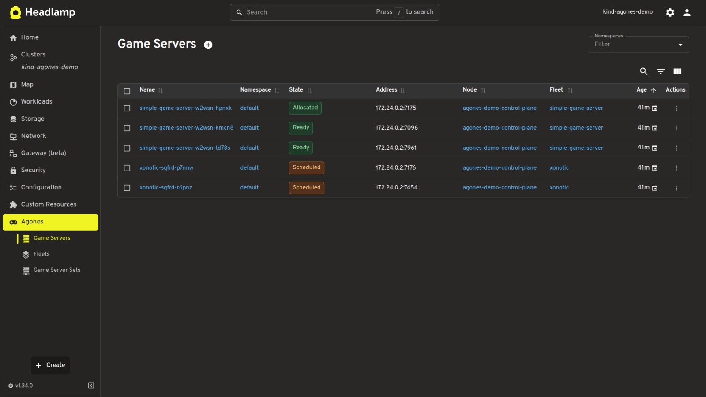
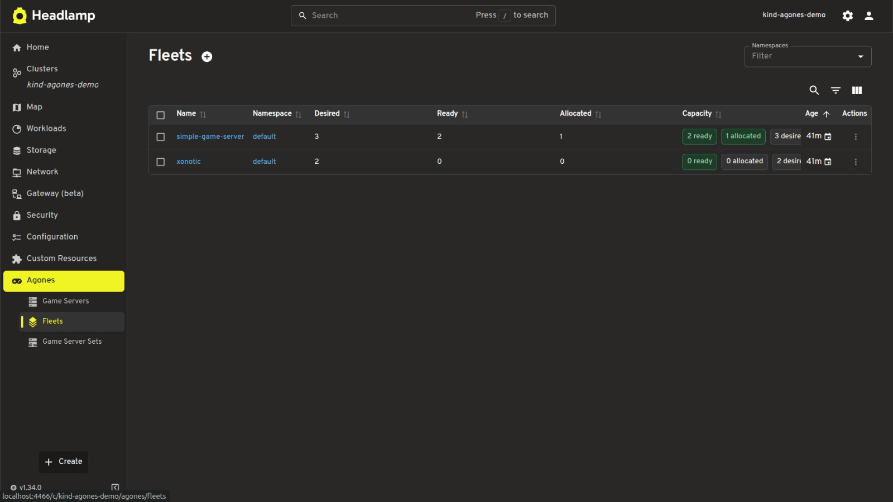
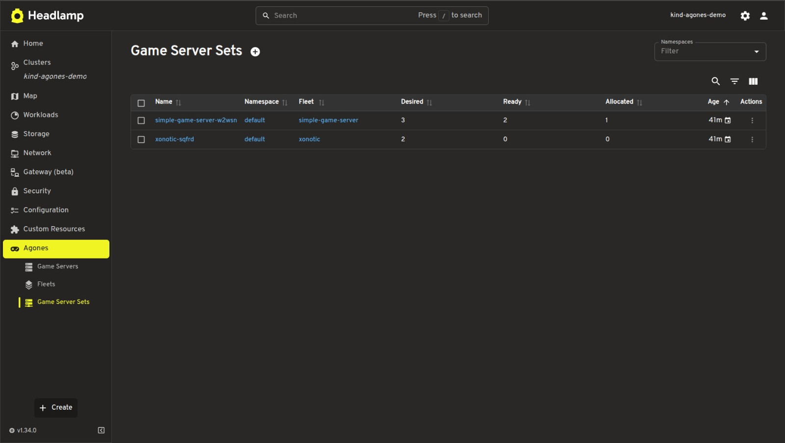
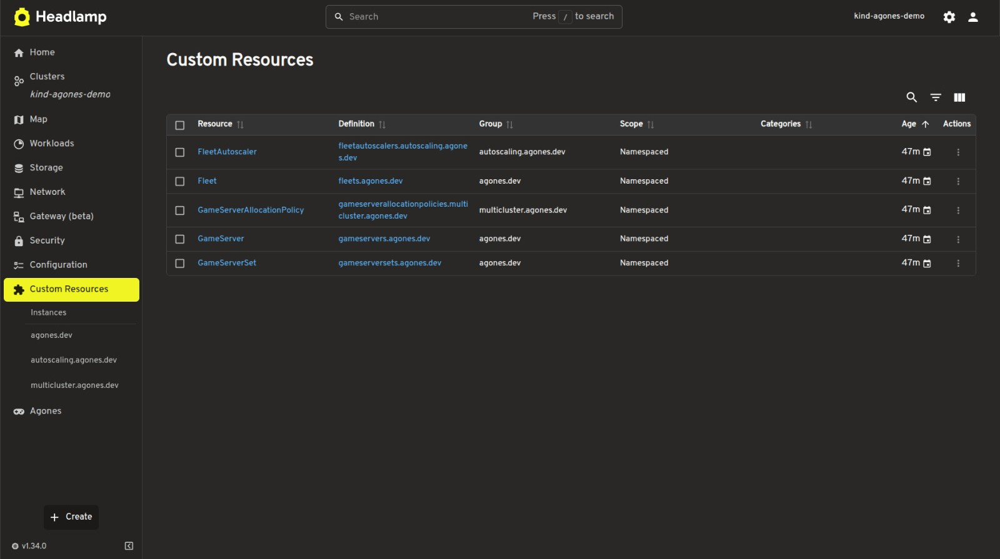
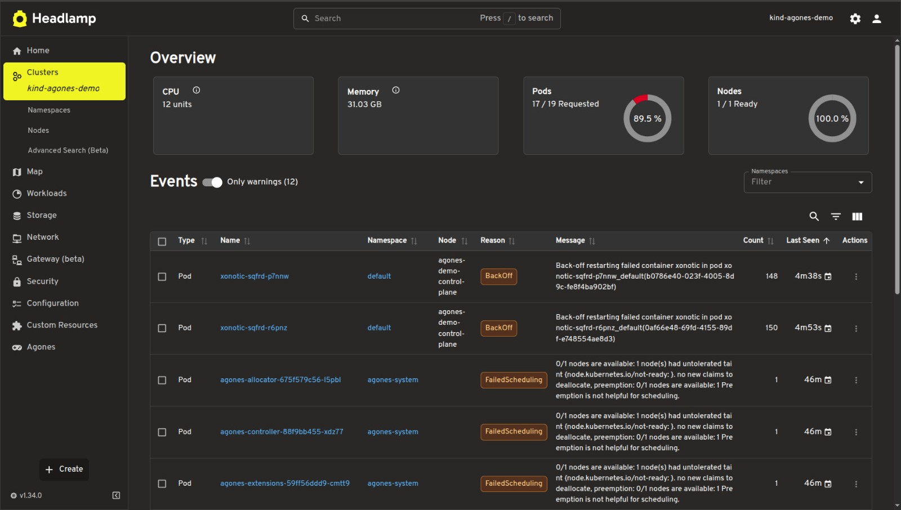
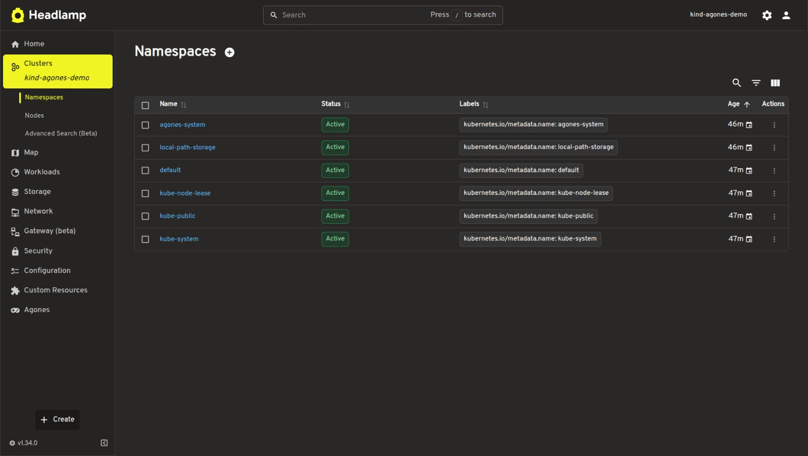
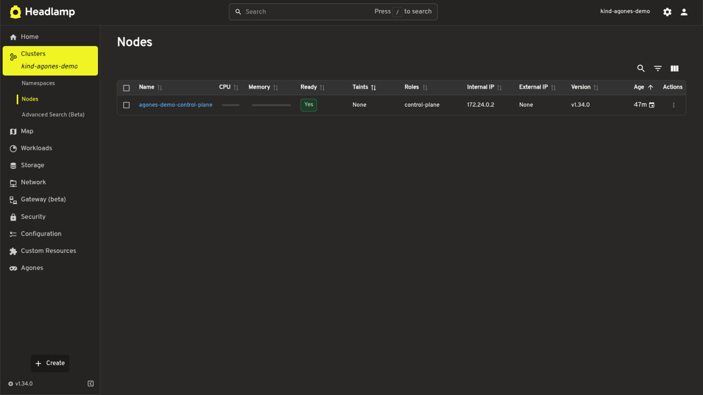

# headlamp-plugin-agones (PoC)

A proof-of-concept Headlamp plugin that surfaces [Agones](https://agones.dev/)
CRDs - `GameServer`, `Fleet`, `GameServerSet` - inside the Headlamp UI with
list views, detail pages, and relational navigation.

> Built as a working artefact for the LFX Mentorship project
> _"Add Agones to Headlamp - Game Server Management UI" (2026 Term 2)_
> tracked at [headlamp-k8s/headlamp#5261](https://github.com/kubernetes-sigs/headlamp/issues/5261).
> The proposal targets a polished plugin; this repo is the smallest thing that
> exercises every load-bearing piece end-to-end so the mentor can sanity-check
> the approach before the program starts.

## Screenshots

### Agones sidebar - Game Servers list
Live view of all `GameServer` resources with state badges (`Allocated`, `Ready`, `Scheduled`), namespace, address, node, and parent fleet.



### Fleets - capacity, replicas, allocation
Each `Fleet` shows desired vs ready vs allocated counts with capacity badges, so operators can see fleet health at a glance.



### Game Server Sets - desired / ready / allocated
The intermediate `GameServerSet` layer is also surfaced for debugging rolling updates and scaling.



### Custom Resources - all Agones CRDs auto-detected
The plugin works on top of Headlamp's CRD discovery - every Agones CRD (`Fleet`, `GameServer`, `GameServerSet`, `FleetAutoscaler`, `GameServerAllocationPolicy`) is recognised and listed.



### Cluster overview - context for the demo environment
Headlamp's standard cluster overview, showing the `kind-agones-demo` cluster with Agones installed.



### Namespaces - Agones system namespace
The Agones controller and allocator run in the `agones-system` namespace, visible alongside user workloads in `default`.



### Nodes - single-node kind cluster
The local `kind` cluster used for the demo.



## What it does today

- Adds a top-level **Agones** section to the Headlamp sidebar with three
  children: Game Servers, Fleets, Game Server Sets.
- Lists every Agones CRD via the in-cluster Kubernetes API - no extra
  controller, no out-of-band fetch.
- Renders summary columns mentioned in the LFX expected outcome:
  - Game Server: name, namespace, **state** (humanized chip), address+port,
    node link, parent fleet link.
  - Fleet: desired / ready / allocated / reserved replicas with a single
    capacity chip group.
  - GameServerSet: parent fleet link, desired / ready / allocated.
- Detail pages show config (collapsible NameValueTables, port table joining
  spec and assigned host ports, health-probe block, backing-pod link) and
  status conditions through Headlamp's standard `DetailsGrid`.
- Bidirectional links: **fleet → gameserversets → gameservers** and
  **gameserver → gameserverset → fleet**. All three navigate via Headlamp's
  `Link` component so cluster context, namespace, and back-button state work
  for free.
- Humanized lifecycle chip: 11 raw `GameServerState` strings collapse into
  three tones (success / warning / error) with a tooltip explaining the raw
  state. Source of truth is
  [`agones/pkg/apis/agones/v1/gameserver.go`](https://github.com/agones-dev/agones/blob/main/pkg/apis/agones/v1/gameserver.go).
- Registers kind icons for the Headlamp cluster Map view so Agones resources
  are recognisable when they appear in resource graphs alongside Deployments,
  Services, etc.

## What it intentionally does **not** do (yet)

These are deferred to the mentorship itself, not the PoC:

- Allocation flow (creating a `GameServerAllocation`).
- `FleetAutoscaler` views.
- Multicluster allocation policy CRDs.
- Edit / scale / delete actions beyond what `DetailsGrid` provides by default.
- Storybook tests, i18n, theme variants.

## Layout

```
src/
├── index.tsx                 # sidebar entries, routes, kind icons
├── lib/
│   ├── classes.ts            # GameServer / Fleet / GameServerSet KubeObject classes
│   └── status.tsx            # state→chip mapping + replica summary
└── pages/
    ├── GameServerList.tsx    # also exports ChildGameServerList for label-scoped lists
    ├── GameServerDetails.tsx # ports, health, backing-pod, related fleet/set
    ├── FleetList.tsx
    ├── FleetDetails.tsx      # owned GameServerSets + child GameServers
    ├── GameServerSetList.tsx
    └── GameServerSetDetails.tsx
```

## Run locally

```bash
# 1. Install plugin deps
npm install

# 2. Boot a kind cluster + Agones with two demo fleets and one allocation
#    (idempotent - re-runnable; pass FRESH=1 to recreate from scratch).
./docs/bootstrap-demo.sh

# 3. Build + watch the plugin. `npm start` auto-copies main.js and
#    package.json into ~/.config/Headlamp/plugins/headlamp-plugin-agones/
#    on every rebuild.
mkdir -p ~/.config/Headlamp/plugins/headlamp-plugin-agones   # one-time
npm start                                                    # leave running

# 4. In a second terminal, build and run Headlamp from the cloned source:
cd ../repos/headlamp
make backend                                   # one-time
cd frontend && npm install && npm run build    # one-time
cd ..
./backend/headlamp-server \
  --plugins-dir ~/.config/Headlamp/plugins \
  --html-static-dir ./frontend/build \
  --kubeconfig ~/.kube/config
```

Open <http://localhost:4466>. The left sidebar shows an **Agones** entry
with Game Servers, Fleets, and Game Server Sets underneath.

> **Alternative:** install the [Headlamp desktop app](https://headlamp.dev/docs/latest/installation/desktop/).
> It reads the same `~/.config/Headlamp/plugins/` directory, so step 4 is
> replaced by launching the app. Step 3 is still required so the plugin
> files land in that directory.

## How the relational nav is wired

Agones controllers stamp two labels on every `GameServer` they create
(see [`gameserverset.go`](https://github.com/agones-dev/agones/blob/main/pkg/apis/agones/v1/gameserverset.go)
and
and [`fleet.go`](https://github.com/agones-dev/agones/blob/main/pkg/apis/agones/v1/fleet.go)):

| Label                       | Set by         | Used here for                                |
| --------------------------- | -------------- | -------------------------------------------- |
| `agones.dev/fleet`          | Fleet ctrl     | "Show me every GS in this fleet"             |
| `agones.dev/gameserverset`  | GameServerSet  | "Show me every GS in this set"               |

The plugin fetches owned children with `useList({ labelSelector: ... })` on
the existing `KubeObject` class - no controller-side helper needed.

## Why this design

A few non-obvious calls worth flagging for a mentor reviewer:

- **Typed `KubeObject` subclasses** instead of `makeCustomResourceClass`. The
  generic factory works, but typed subclasses give us autocomplete on
  `.status.allocatedReplicas`, etc., and let getters like `connectionString`
  live next to the data they format. This matches how the upstream Headlamp
  codebase models Gateway API resources
  ([`frontend/src/lib/k8s/gateway.ts`](https://github.com/kubernetes-sigs/headlamp/blob/main/frontend/src/lib/k8s/gateway.ts)).
- **One state chip, three tones.** The 11 raw `GameServerState` strings are
  noisy when they appear next to each other in a list. Operators care about
  "is this server serving / coming up / broken." `STATE_MAP` in
  [`status.tsx`](src/lib/status.tsx) tags every state with a tone and keeps
  the raw string on hover so power users still see ground truth.
- **`ChildGameServerList` is the same component as the top-level list.** It
  takes `namespace + labelSelector` and renders the same `ResourceListView`
  with a subset of columns. One component, two callers, zero divergent code
  paths.

## References

- LFX listing - _Add Agones to Headlamp - Game Server Management UI_, 2026 T2
- Upstream tracking issue: [`headlamp-k8s/headlamp#5261`](https://github.com/kubernetes-sigs/headlamp/issues/5261)
- Headlamp plugin docs: <https://headlamp.dev/docs/latest/development/plugins/>
- Agones CRD types: `agones/pkg/apis/agones/v1/`
- Headlamp `KubeObject` base: `frontend/src/lib/k8s/KubeObject.ts`
- Reference plugin examples used here: `plugins/examples/{sidebar,tables,details-view}`
